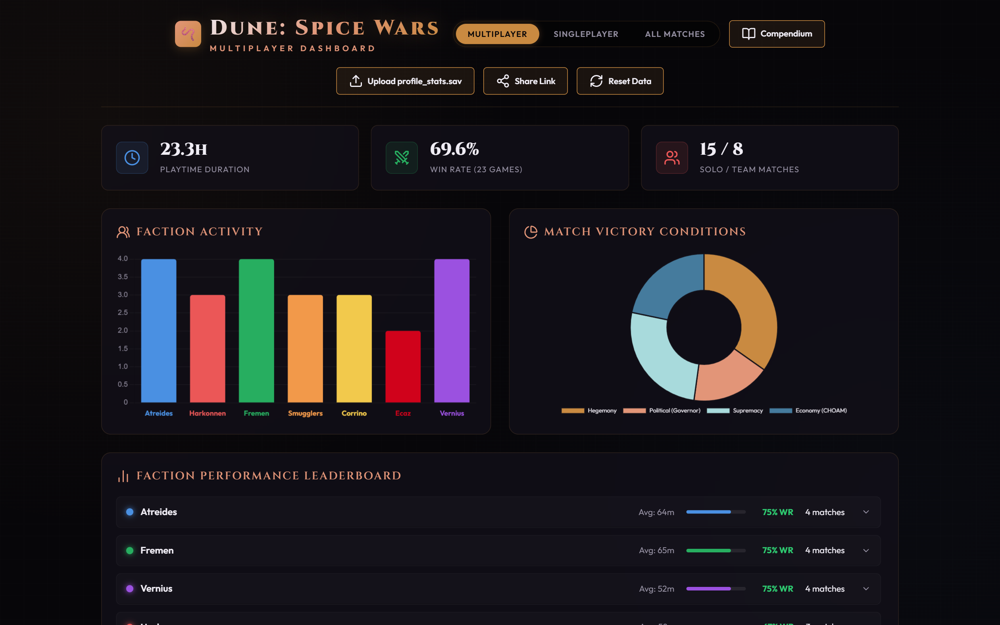

# Dune: Spice Wars — Dashboard & Compendium

A browser-based companion for **[Dune: Spice Wars](https://store.steampowered.com/app/1605220/Dune_Spice_Wars/)**.
Drop in your `profile_stats` save file to visualize your match history, and browse a
full reference compendium of units, buildings, factions, and more — all in a single
static page that runs **100% in your browser**. No account, no upload, no server.

**▶ Live site: <https://herraa918.github.io/dune-spice-wars-dashboard/>**



> The screenshot above uses sample data. Your own save stays entirely on your machine.

---

## Highlights

- **Match-history dashboard** — playtime, win rate, faction activity, victory-condition
  breakdown, a faction performance leaderboard, hero/councillor stats, and a sortable,
  filterable match table with per-game detail.
- **Multiplayer / Singleplayer / All** mode switch, auto-detected from your save.
- **Compendium** — searchable reference for units, buildings, sietches, tech trees,
  Landsraad politics, faction overviews, operations, village bonuses, and a match
  randomizer (see below).
- **Shareable links** — send a snapshot of your results to a friend with one click; the
  data travels inside the URL, so there is still no server involved.
- **Private by design** — everything is parsed and rendered locally in your browser.

---

## Getting started

1. Open the **[live site](https://herraa918.github.io/dune-spice-wars-dashboard/)**.
2. Drag and drop your `profile_stats_*.sav` file onto the page (or click to browse).
3. Explore your stats. Use the mode switcher and the table filters to slice the data.

### Where is my save file?

**Steam (Windows):**

```
C:\Program Files (x86)\Steam\steamapps\common\D4X\save\profile_stats_XXXXXXX.sav
```

The code in the filename (e.g. `XXXXXXX`) is unique to your Steam account — check your
`save` folder for your specific file. The file is read locally; it is never uploaded.

---

## Features in detail

### Dashboard (`dashboard.html`)

- **Summary cards:** total playtime, overall win rate, solo vs. team match counts (and
  conquest campaigns in single-player mode).
- **Faction Activity:** how often you play each of the seven factions.
- **Match Victory Conditions:** how your wins break down across Hegemony, Supremacy,
  Economy (CHOAM), and Political (Governor).
- **Faction Performance Leaderboard:** average match length, win rate, and games played
  per faction.
- **Hero & Councillor stats:** play/win rates for the leaders and advisors you field.
- **Match table:** every game with date, faction, outcome, victory condition, format,
  hero, and duration — searchable, filterable (faction / outcome / format), sortable,
  and paginated. Click a row for a detail view.

### Compendium (`compendium.html`)

A reference guide with its own tabbed navigation:

- **Units / Buildings / Sietches** — searchable cards with dynamic type-filter pills that
  adapt to the current tab and selected faction.
- **Tech Trees** and **Landsraad & Politics** references.
- **Factions Overview** — traits, Hegemony milestone bonuses, and councillors for every
  faction (pick "All Factions" to see them all stacked).
- **Operations** — universal and faction-specific covert operations.
- **Village Bonuses** — every village specialization and its effect.
- **Match Randomizer** — add up to four players, assign each a unique random faction
  (with re-rolls, locks, exclusions, and a random councillor), for drafting fresh games.

### Shareable links

Click **Share Link** after loading a save to copy a self-contained URL to your clipboard.
The data is gzip-compressed and stored in the URL's `#` fragment, which browsers never
send to the server — so opening the link renders the same stats locally, with a banner
making clear it's a shared snapshot. A shared link is only as private as wherever you
paste it, since anyone with the URL can decode the data it carries.

---

## How it works / tech notes

- **No build step.** Everything is plain HTML, CSS, and vanilla JavaScript in a couple of
  self-contained files. [Chart.js](https://www.chartjs.org/) and
  [Lucide](https://lucide.dev/) are loaded from a CDN.
- **Save parsing** is done client-side with a small [Haxe](https://haxe.org/) deserializer
  (Dune: Spice Wars serializes its save data with Haxe's serialization format).
- **Hosting** is static [GitHub Pages](https://pages.github.com/); `index.html` simply
  forwards to `dashboard.html`.

### Repository layout

| Path                | Purpose                                            |
| ------------------- | -------------------------------------------------- |
| `index.html`        | GitHub Pages entry point (redirects to dashboard). |
| `dashboard.html`    | Match-history dashboard + save parser.             |
| `compendium.html`   | Reference compendium + match randomizer.           |
| `docs/`             | README screenshots.                                |

---

## Privacy

This tool does not collect, transmit, or store any data on a server. Your save file is
read in your browser and never leaves your machine unless *you* choose to create and share
a link. The published site ships with no preloaded match data.

## Disclaimer

A fan-made, unofficial project. *Dune: Spice Wars* is developed by Shiro Games and
published by Funcom; *Dune* and related names are trademarks of their respective owners.
Game data in the compendium is sourced from the community
[Dune: Spice Wars Wiki](https://dunespicewars.fandom.com/).
