# Dune: Spice Wars — Dashboard & Compendium

A browser-based companion for **[Dune: Spice Wars](https://store.steampowered.com/app/1605220/Dune_Spice_Wars/)**.
Drop in your `profile_stats` save file to visualize your match history, and browse a
full reference compendium of units, buildings, factions, and more — all in a single
static page that runs **100% in your browser**. No account, no upload, no server.

**▶ Live site: <https://herraa918.github.io/dune-spice-wars-dashboard/>**

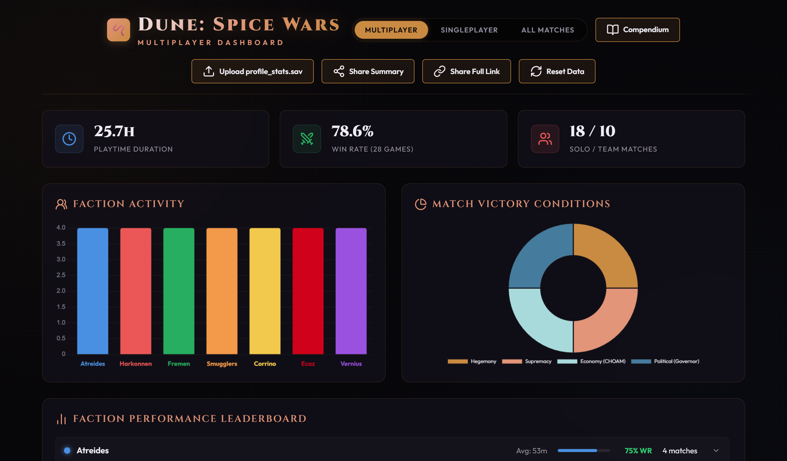

> All screenshots use sample data. Your own save stays entirely on your machine.

---

## Highlights

- **Match-history dashboard** — playtime, win rate, faction activity, victory-condition
  breakdown, a faction performance leaderboard, hero/councillor stats, and a sortable,
  filterable match table with per-game detail.
- **Compendium** — searchable reference for units, buildings, sietches, tech trees,
  Landsraad politics, faction overviews, operations, village bonuses, plus a match
  randomizer.
- **Shareable links** — send your full results or a compact summary to a friend; the
  data rides inside the URL, so there is still no server involved.
- **Private by design** — everything is parsed and rendered locally in your browser.

---

## Getting started

1. Open the **[live site](https://herraa918.github.io/dune-spice-wars-dashboard/)**.
2. Drag and drop your `profile_stats_*.sav` file onto the page (or click to browse).
3. Explore your stats. Use the mode switcher (Multiplayer / Singleplayer / All) and the
   table filters to slice the data.

### Where is my save file?

**Steam (Windows):**

```
C:\Program Files (x86)\Steam\steamapps\common\D4X\save\profile_stats_XXXXXXX.sav
```

The code in the filename (e.g. `XXXXXXX`) is unique to your Steam account — check your
`save` folder for your specific file. The file is read locally; it is never uploaded.

---

## The Dashboard

### Upload your save

Open the page and you're greeted with a drop zone. Drag your `profile_stats_*.sav` onto
it (or click to browse). Parsing happens entirely in your browser — nothing is sent
anywhere. The page also tells you where to find the file.

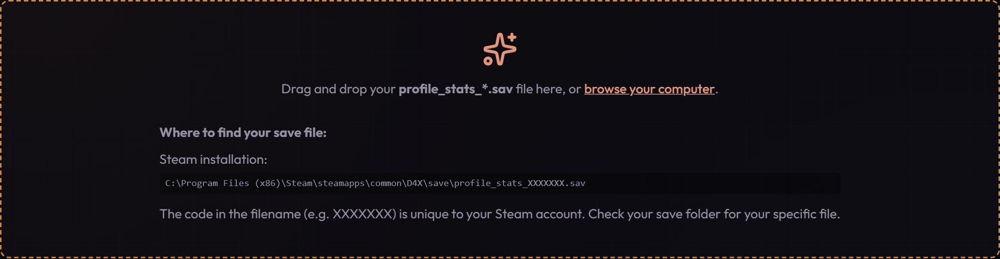

### At-a-glance stats

The top row summarizes the currently selected mode: total **playtime**, overall **win
rate** (and games counted), the **solo / team** split, and — in single-player — your
**conquest campaign** count.

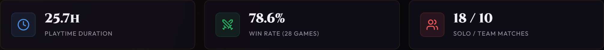

### Faction Activity

A bar chart of how many games you've played as each of the seven factions, color-coded to
match each House. Hover a bar for a quick faction blurb.

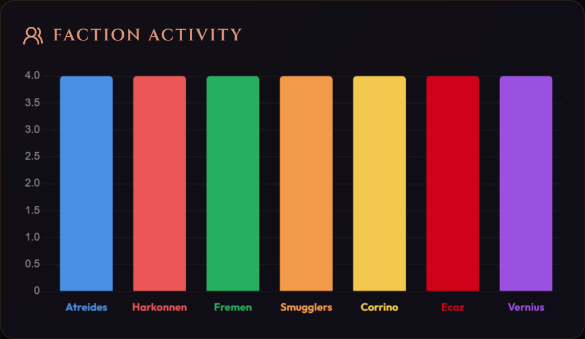

### Match Victory Conditions

A doughnut chart breaking down how your matches end — Hegemony, Supremacy, Economy
(CHOAM), Political (Governor), and any abandoned/incomplete games — so you can see which
win conditions you actually close out.

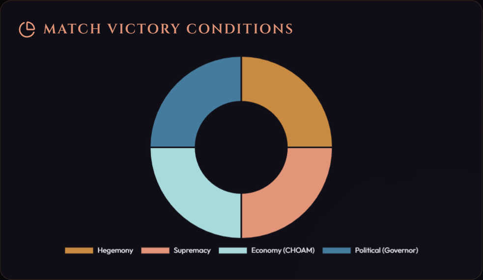

### Faction Performance Leaderboard

Each faction's average match length, win rate, and games played, sorted by activity.
Click any faction to expand a per-**hero** and per-**councillor** breakdown with their own
play counts and win rates.

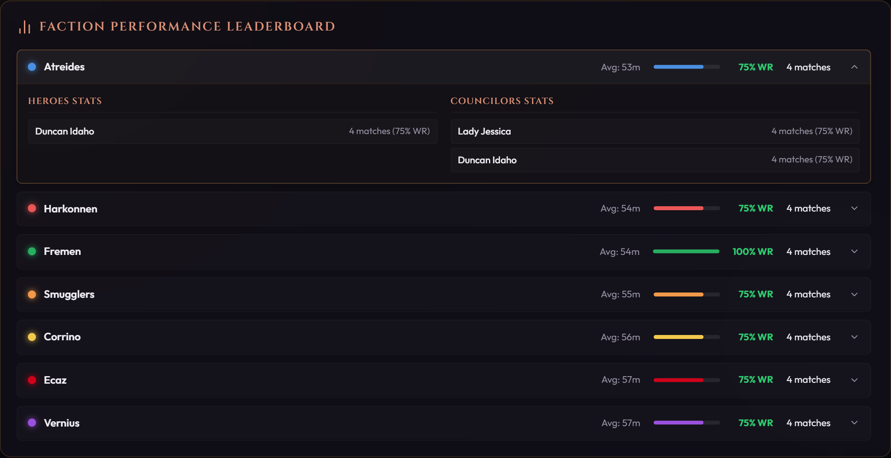

### Match History

Every game in a sortable, paginated table — date, faction, outcome, victory condition,
format, hero, duration, and sandworm/supply deaths. Search by player, councillor, hero, or
date, and filter by faction, outcome, or format.

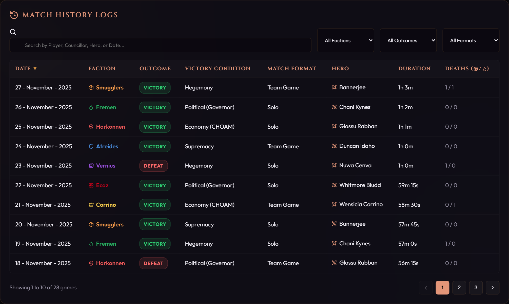

### Match detail

Click any row to open a full match profile: outcome and winner, end reason, hero unit,
councillors, duration, difficulty, death breakdown, and the operations executed that game.

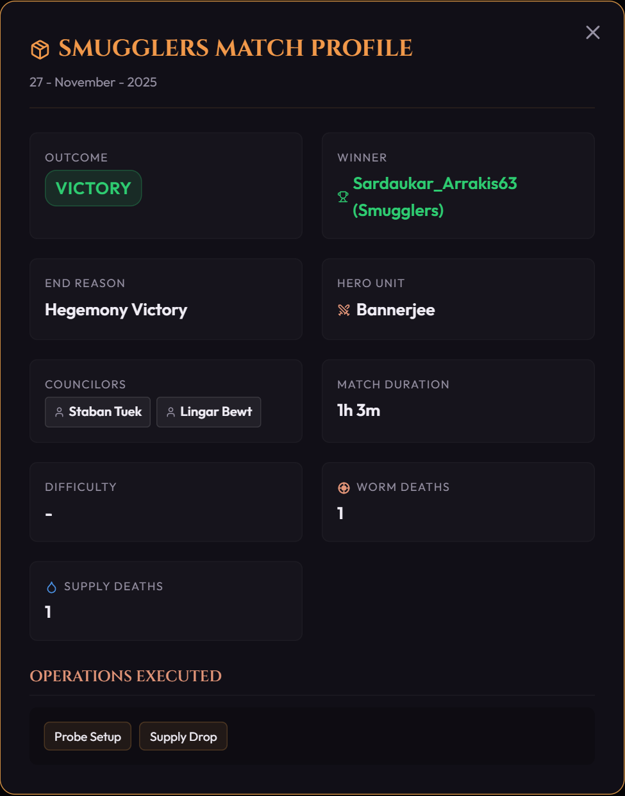

### Sharing your results

Two share buttons live in the header:

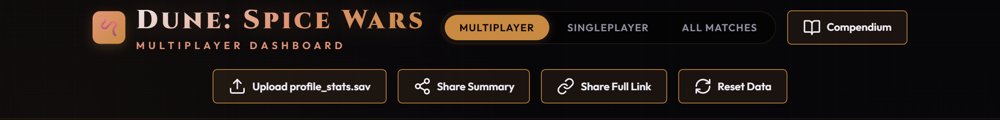

- **Share Summary** — copies a short link containing just the aggregates (cards, charts,
  and leaderboard). It stays small no matter how many games you have (a ~600-character
  URL), so it pastes inline in most chat apps. The recipient sees a summary view without
  the per-game table.
- **Share Full Link** — copies a link containing your full (trimmed) match data so the
  recipient gets the complete dashboard, including the match table and per-game detail.
  This link grows with your history and can get long.

Either way the data lives in the URL's `#` fragment, which browsers never send to a
server, and the recipient sees a banner making clear they're viewing a shared snapshot.

---

## The Compendium

A reference guide with its own tabbed navigation. Click **Compendium** in the dashboard
header (or the live site's compendium link) to open it.

### Units, Buildings & Sietches

Searchable cards for every unit, building, and sietch, with type-filter pills that adapt
to the current tab and the selected faction. Filter by House to see only that faction's
roster.

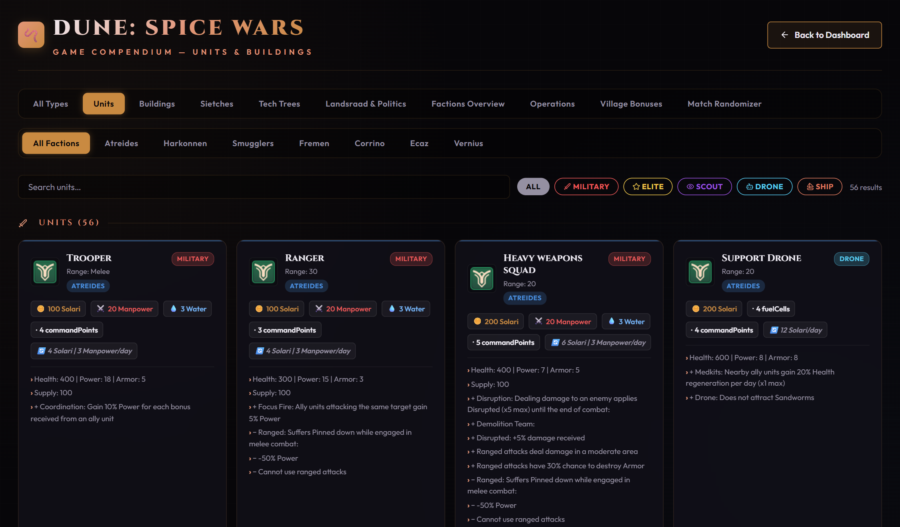

### Factions Overview

Traits, Hegemony milestone bonuses (5k / 10k), and councillors for every faction. Pick a
single House to focus on it, or **All Factions** to see them all stacked.

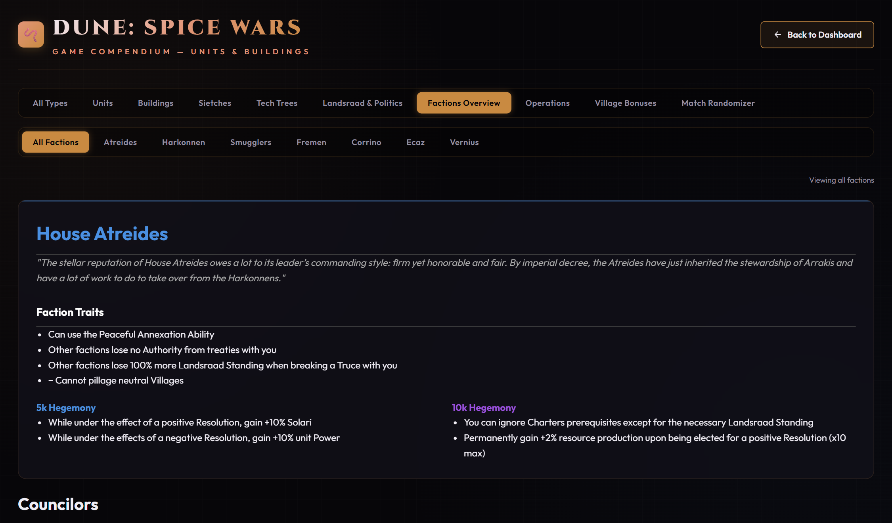

### Operations

Universal and faction-specific covert operations, with their cost, difficulty, and effect,
grouped by faction.

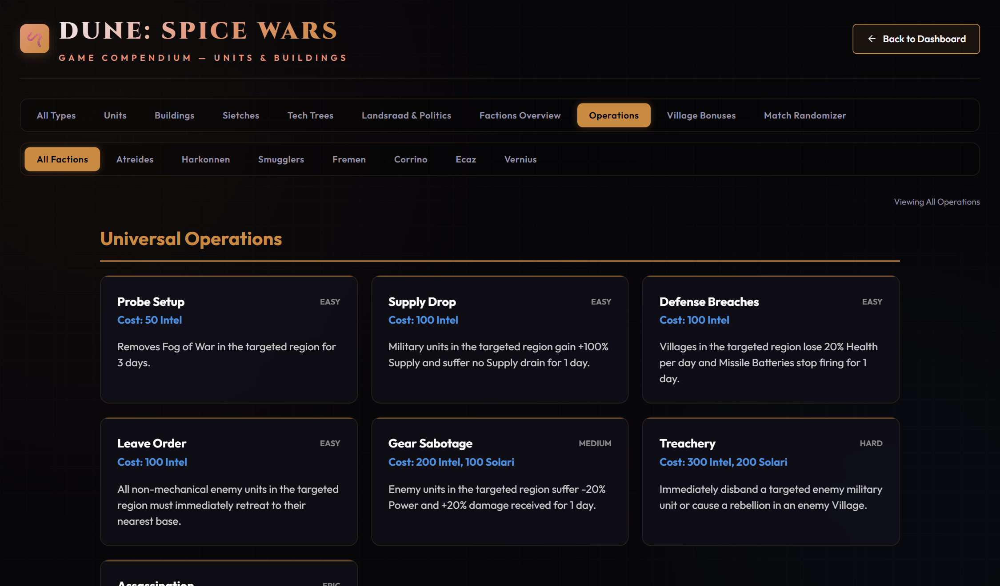

### Village Bonuses

Every village specialization and production bonus, grouped by category, so you can plan
how to develop captured villages.

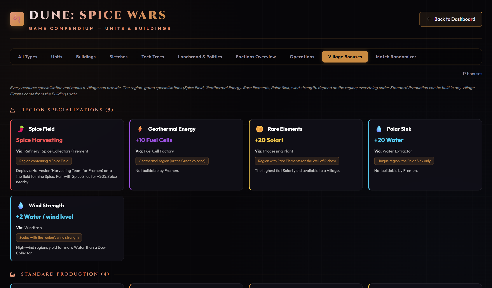

### Match Randomizer

Add up to four players and assign each a **unique** random faction. Re-roll any faction,
get a random suggested councillor, and lock or exclude factions to fine-tune the draft —
handy for spicing up a lobby.

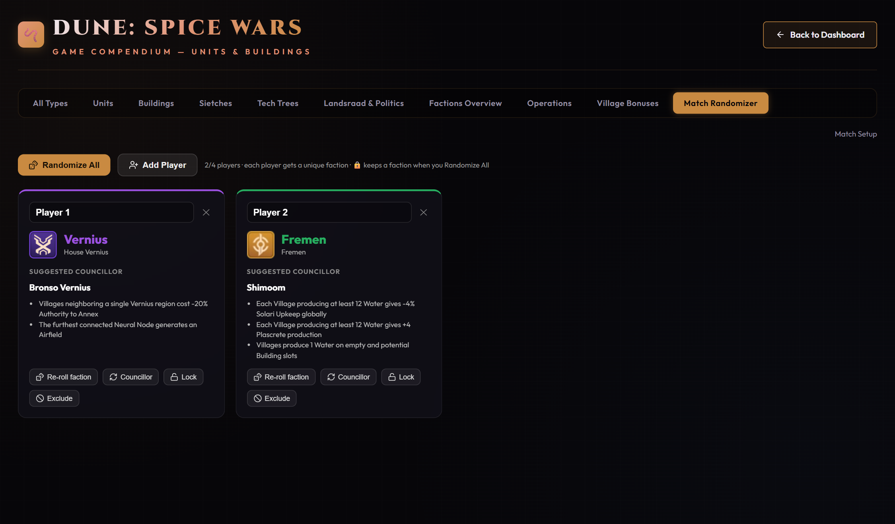

---

## How it works / tech notes

- **No build step.** Everything is plain HTML, CSS, and vanilla JavaScript in a couple of
  self-contained files. [Chart.js](https://www.chartjs.org/) and
  [Lucide](https://lucide.dev/) are loaded from a CDN.
- **Save parsing** is done client-side with a small [Haxe](https://haxe.org/) deserializer
  (Dune: Spice Wars serializes its save data with Haxe's serialization format).
- **Share links** gzip the data into the URL fragment (`#…`), which is never sent to the
  server, so shared stats stay client-side.
- **Hosting** is static [GitHub Pages](https://pages.github.com/); `index.html` simply
  forwards to `dashboard.html`.

### Repository layout

| Path                | Purpose                                            |
| ------------------- | -------------------------------------------------- |
| `index.html`        | GitHub Pages entry point (redirects to dashboard). |
| `dashboard.html`    | Match-history dashboard + save parser.             |
| `compendium.html`   | Reference compendium + match randomizer.           |
| `docs/`             | README screenshots.                                |

---

## Privacy

This tool does not collect, transmit, or store any data on a server. Your save file is
read in your browser and never leaves your machine unless *you* choose to create and share
a link — and a shared link is only as private as wherever you paste it, since anyone with
the URL can decode the data it carries. The published site ships with no preloaded match
data.

## Disclaimer

A fan-made, unofficial project. *Dune: Spice Wars* is developed by Shiro Games and
published by Funcom; *Dune* and related names are trademarks of their respective owners.
Game data in the compendium is sourced from the community
[Dune: Spice Wars Wiki](https://dunespicewars.fandom.com/).
