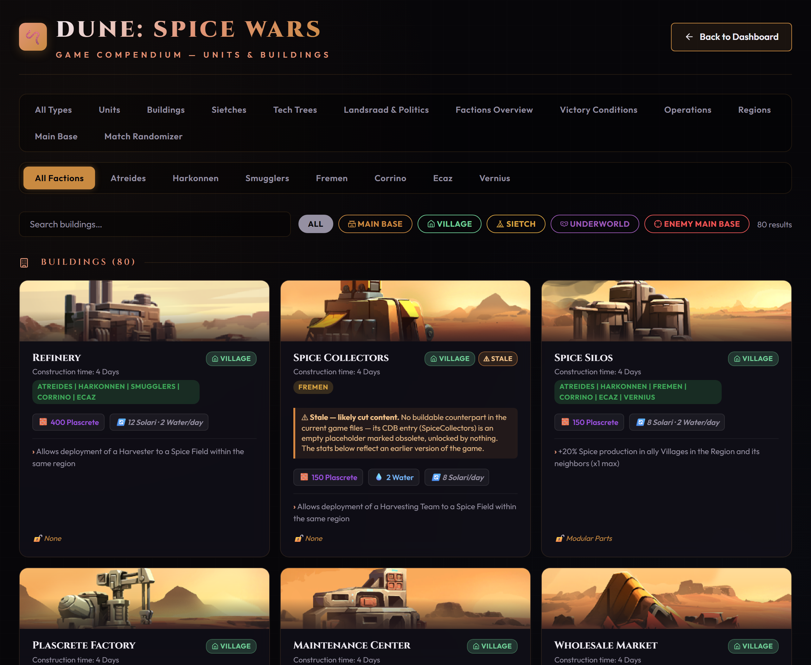
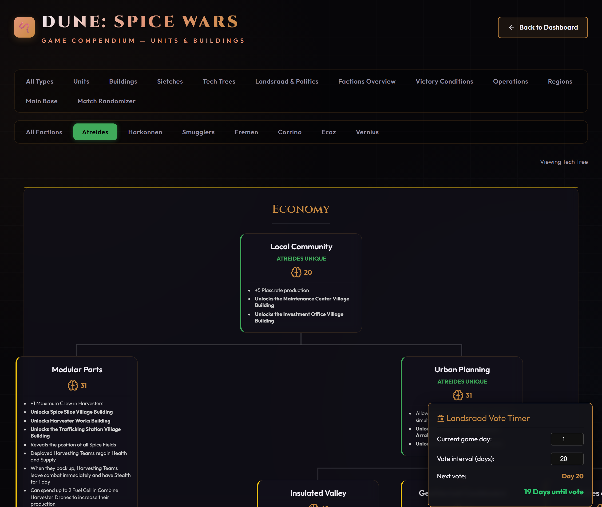
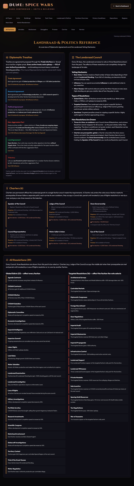
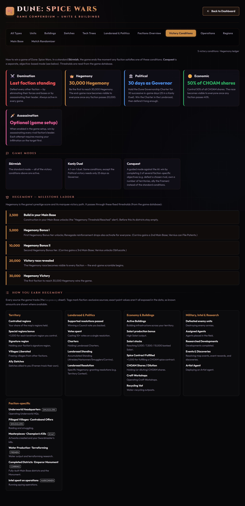
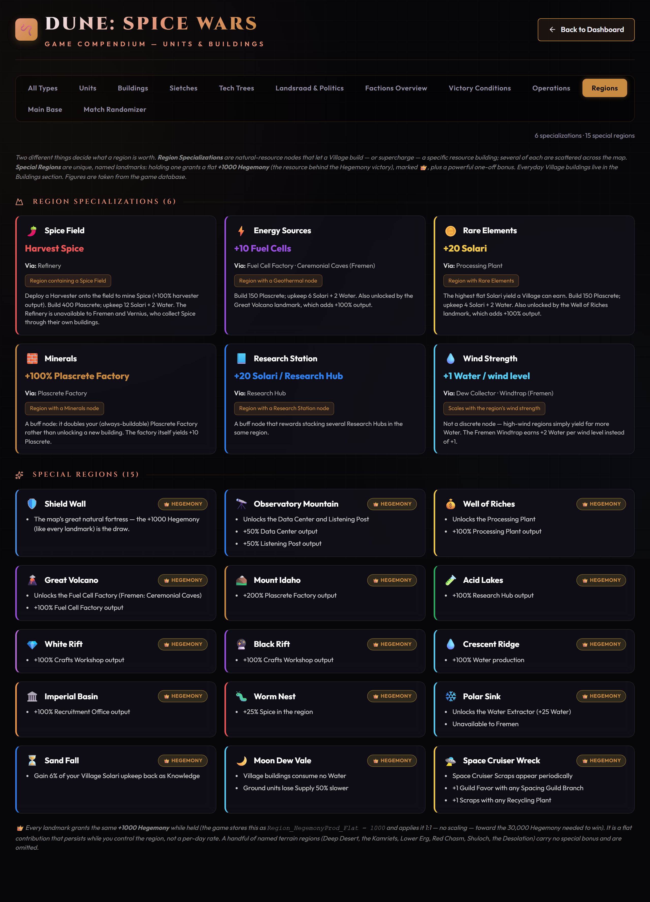
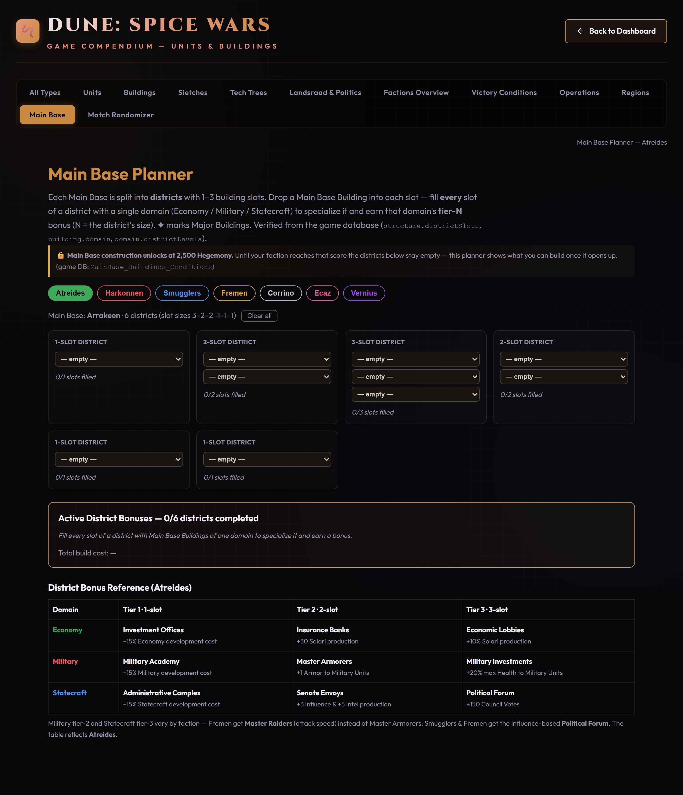

# Dune: Spice Wars — Dashboard & Compendium

A browser-based companion for **[Dune: Spice Wars](https://store.steampowered.com/app/1605220/Dune_Spice_Wars/)**.
Drop in your `profile_stats` save file to visualize your match history, and browse a
full reference compendium of units, buildings, factions, and more — all in a single
static page that runs **100% in your browser**. No account, no upload, no server.

**▶ Live site: <https://herraa918.github.io/dune-spice-wars-dashboard/>**


> All screenshots use sample data. Your own save stays entirely on your machine.

---

## Highlights

- **Match-history dashboard** — playtime, win rate, faction activity, victory-condition
  breakdown, a faction performance leaderboard, hero/councillor stats, and a sortable,
  filterable match table with per-game detail.
- **Compendium** — searchable reference for units (with live **DPS** + gear loadouts),
  buildings, sietches, tech trees, Landsraad politics & treaties, faction overviews,
  victory conditions & the **Hegemony ledger**, operations, regions, and an interactive
  **Main Base district planner** — plus a match randomizer.
- **Shareable links** — send your full results or a compact summary to a friend; the
  data rides inside the URL, so there is still no server involved.
- **CSV export** — download your match history (honoring the active filters and sort) as
  a spreadsheet for your own analysis.
- **Private by design** — everything is parsed and rendered locally in your browser.

---

## Getting started

1. Open the **[live site](https://herraa918.github.io/dune-spice-wars-dashboard/)**.
2. Drag and drop your `profile_stats_*.sav` file onto the page (or click to browse).
3. Explore your stats. Use the mode switcher (Multiplayer / Singleplayer / All) and the
   table filters to slice the data.

### Where is my save file?

**Steam (Windows):**

```
C:\Program Files (x86)\Steam\steamapps\common\D4X\save\profile_stats_XXXXXXX.sav
```

The code in the filename (e.g. `XXXXXXX`) is unique to your Steam account — check your
`save` folder for your specific file. The file is read locally; it is never uploaded.

---

## The Dashboard

### Upload your save

Open the page and you're greeted with a drop zone. Drag your `profile_stats_*.sav` onto
it (or click to browse). Parsing happens entirely in your browser — nothing is sent
anywhere. The page also tells you where to find the file.


### At-a-glance stats

The top row summarizes the currently selected mode: total **playtime**, overall **win
rate** (over *decided* games only — abandoned/unfinished games don't count), your
**win · loss · incomplete** record, and — in single-player — your **conquest campaign**
count.


### Faction Activity

A bar chart of how many games you've played as each of the seven factions, color-coded to
match each House. Hover a bar for a quick faction blurb.


### Match Victory Conditions

A doughnut chart breaking down how your matches end — Hegemony, Supremacy, Economy
(CHOAM), Political (Governor), and any abandoned/incomplete games — so you can see which
win conditions you actually close out.


### Faction Performance Leaderboard

Each faction's average match length, win rate, and games played, sorted by activity.
Click any faction to expand a per-**hero** and per-**councillor** breakdown with their own
play counts and win rates.


### Match History

Every game in a sortable, paginated table — date, faction, outcome, victory condition,
hero, duration, and sandworm/supply deaths. Outcomes are Victory, Defeat, or **Incomplete**
(abandoned/unfinished games, which are not counted as losses). Search by player, councillor,
hero, or date, and filter by faction or outcome.


### Match detail

Click any row to open a full match profile: outcome and winner, end reason, hero unit,
councillors, duration, difficulty, death breakdown, and the operations executed that game.


### Export to CSV

Need your match history outside the dashboard? The **Export CSV** button in the header
downloads the current table as a spreadsheet (`dune-spice-wars-matches-YYYY-MM-DD.csv`),
honoring whatever search, filters, and sort you've applied — so you can pull, say, just
your Atreides victories. It carries a slightly richer column set than the on-screen table
(player, councillors, difficulty, raw duration in seconds, and the operations run that
game) and, like the share links, it's generated entirely in your browser with nothing
uploaded.

### Sharing your results

The header also holds two share buttons (alongside the Export CSV button above):


- **Share Summary** — copies a short link containing just the aggregates (cards, charts,
  and leaderboard). It stays small no matter how many games you have (a ~600-character
  URL), so it pastes inline in most chat apps. The recipient sees a summary view without
  the per-game table.
- **Share Full Link** — copies a link containing your full (trimmed) match data so the
  recipient gets the complete dashboard, including the match table and per-game detail.
  This link grows with your history and can get long.

Either way the data lives in the URL's `#` fragment, which browsers never send to a
server, and the recipient sees a banner making clear they're viewing a shared snapshot.

---

## The Compendium

A reference guide with its own tabbed navigation. Click **Compendium** in the dashboard
header (or the live site's compendium link) to open it.

### Units, Buildings & Sietches

Searchable cards for every unit, building, and sietch, with type-filter pills that adapt to
the current tab and the selected faction. Cards use the **real in-game art** — unit portraits,
building illustrations, and faction crests extracted straight from the game files. Unit cards
carry full stats including a computed **DPS**, plus an interactive **gear loadout** — pick each
unit's equipment and the stats (and DPS) recompute live. Filter by House to see only that
faction's roster.




### Tech Trees

The full development tree for each faction with an interactive cost calculator: select the
developments you plan to research and it totals their cost and shows what each unlocks.
Faction-specific replacements are shown in place of the generic techs they swap out.



### Landsraad & Politics

A reference for diplomacy and the Landsraad. Every **treaty** with its real effect, cost, and
the −10% Authority upkeep each active treaty carries; the **Council** voting mechanics and
resolution-draw rules; all **Charters**; and the full resolution pool.



### Factions Overview

Traits, Hegemony milestone bonuses (5k / 10k), and councillors for every faction. Pick a
single House to focus on it, or **All Factions** to see them all stacked.


### Victory Conditions & Hegemony

Every way to win — Domination, Hegemony, Political, Economic, and (optional) Assassination —
with the exact thresholds and the three game modes. Plus a **Hegemony deep-dive**: the
milestone ladder (2,500 = build in your Main Base → 5k / 10k bonus tiers → 20k race → 30k
victory) and a full ledger of every source that generates Hegemony.



### Operations

Universal and faction-specific covert operations with their cost, difficulty, effect, and the
**Infiltration field + level** each requires — plus a reference for the five Infiltration
fields (Arrakis, Spacing Guild, CHOAM, Landsraad, Opponent Faction).


### Regions

What each region is worth, in two parts: **Region Specializations** (natural-resource nodes
that unlock or supercharge a specific village building) and **Special Regions** (unique named
landmarks that each grant **+1,000 Hegemony** while held, plus a powerful one-off bonus).



### Main Base Planner

An interactive planner for your Main Base. Each faction's base is laid out as its real
districts (1–3 building slots each); drop a building into each slot, and filling a district
with a single domain (Economy / Military / Statecraft) earns that domain's tier-N bonus. It
tallies the active district bonuses and total build cost, handles the faction quirks (Vernius
auto-split, Fremen Bazaar wildcard, Corrino multi-base), and flags the 2,500-Hegemony
construction gate.



### Match Randomizer

Add up to four players and assign each a **unique** random faction. Re-roll any faction,
**pick each player's two councillors** from their faction's pool (or roll a random pair),
and lock or exclude factions to fine-tune the draft — handy for spicing up a lobby.


---

## How it works / tech notes

- **No build step.** Everything is plain HTML, CSS, and vanilla JavaScript in a couple of
  self-contained files. [Chart.js](https://www.chartjs.org/) and
  [Lucide](https://lucide.dev/) are loaded from a CDN.
- **Save parsing** is done client-side with a small [Haxe](https://haxe.org/) deserializer
  (Dune: Spice Wars serializes its save data with Haxe's serialization format).
- **Share links** gzip the data into the URL fragment (`#…`), which is never sent to the
  server, so shared stats stay client-side.
- **Hosting** is static [GitHub Pages](https://pages.github.com/); `index.html` simply
  forwards to `dashboard.html`.

### Repository layout

| Path                | Purpose                                            |
| ------------------- | -------------------------------------------------- |
| `index.html`        | GitHub Pages entry point (redirects to dashboard). |
| `dashboard.html`    | Match-history dashboard + save parser.             |
| `compendium.html`   | Reference compendium + match randomizer.           |
| `docs/`             | README screenshots.                                |

---

## Privacy

This tool does not collect, transmit, or store any data on a server. Your save file is
read in your browser and never leaves your machine unless *you* choose to create and share
a link — and a shared link is only as private as wherever you paste it, since anyone with
the URL can decode the data it carries. The published site ships with no preloaded match
data.

## Disclaimer

A fan-made, unofficial project. *Dune: Spice Wars* is developed by Shiro Games and
published by Funcom; *Dune* and related names are trademarks of their respective owners.
Game data in the compendium is derived from the game's own data files (the `data.cdb`
database shipped with the install) and verified against them; a few values that aren't
cleanly exposed in the data are cross-referenced with the community
[Dune: Spice Wars Wiki](https://dunespicewars.fandom.com/).
